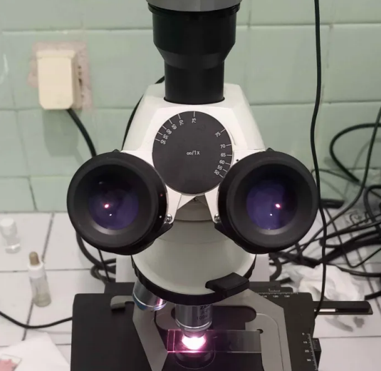
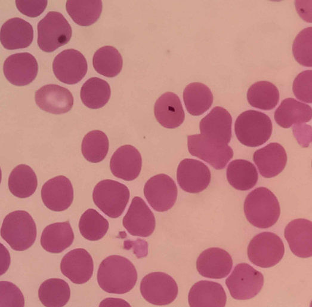
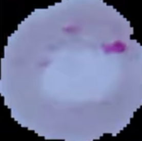
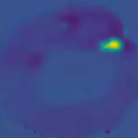

  
  

# Malaria Detection Project

**This repository is my work, developed during my summer internship at the CRISTAL Lab**  
*(Research Center in Networks, Image, Systems, Architecture, and Multimedia - LR99ES25)*.  
**The project was a collaborative effort between CRISTAL Lab and the Parasitology & Mycology Lab Center at Charles Nicole Hospital, Tunisia.**

## Technical Report
A detailed technical report outlining the methodologies and findings is available on my ResearchGate profile:  
[**Detection of Malaria from Microscopic Images**](https://www.researchgate.net/publication/385817862_Detection_de_Malaria_a_partir_d'images_microscopiques).

## 🚀 Streamlit App Concept

### 🎬 Full App Demo

.gif)

### 🔬 Bringing AI to Malaria Diagnosis

This app is designed to **assist doctors** in diagnosing malaria from blood smear images using an interactive **Streamlit** interface. Developed with **custom ML tools** tailored for **Tunisian hospitals**, it adapts to real-world **microscopic imaging conditions** for accurate and reliable parasite detection.

### ⚡ How It Works

- **Upload a Blood Smear Image:** Drag and drop your sample image into the app.
- **AI-Powered Parasite Detection:** The model highlights malaria parasites with bounding boxes.
- **Smart Classification:** Each detected parasite is labeled by type.
- **Dynamic Visualization:** See instant stats, charts, and a clear infection diagnosis.

✅ **Intuitive. Fast. Designed for medical professionals.**

## Data Collection
The dataset was gathered at the **Parasitology & Mycology Lab Center** of Charles Nicole Hospital using blood smears infected with malaria. In close collaboration with expert biologists and doctors over multiple sessions, we documented the data collection process. Images were captured with a **Canon EOS 1000D** and a **Zeiss Axiolab microscope** at **100x magnification**.

<table>
  <tr>
    <td align="center">
       
      <em>Dataset Capture Setup (photo captured during sessions)</em>
    </td>
    <td align="center">
       
      <em>Dataset Sample (photo captured during sessions)</em>
    </td>
  </tr>
</table>

## Upcoming README Updates

**Note:** While the current technical report focuses on the core functionalities, additional features have already been implemented, including:

- **Histogram Visualization:** Displaying the frequency of various parasite types (schizonts, gametocytes, rings, and trophozoites).
- **Continuous Learning & Flagging:** A system that allows doctors to flag false predictions to continuously improve the model.
- **Uncertainty Quantification & Explainable AI (XAI):**  
  Demonstration of model explanations: the left image is a sample cell with its parasite from our dataset, and the right is its corresponding [Weight-Class Activation Map](https://arxiv.org/abs/1610.02391).

  <table>
    <tr>
      <td align="center" style="padding-right: 40px;">
         
        <em>Cell & Parasite</em>
      </td>
      <td align="center" style="padding-left: 4 0px;">
         
        <em> Activation Heatmap</em>
      </td>
    </tr>
  </table>

Future updates to this README will include detailed documentation and usage instructions for these enhancements as the project evolves.

## Acknowledgements
*I would like to kindly thank **Prof. Dhouib Dorra**, my internship supervisor, the **CRISTAL Lab team**, and **Dr. Sonia Trabelsi-Gritli**, Head of the Parasitology & Mycology Lab Center, for their invaluable time and guidance.*

## Note
*This repository contains a skeleton structure of an ongoing project developed during my internship at CRISTAL Lab. Regular meetings with lab doctors continue to refine the project, and all code remains the property of CRISTAL Lab.*
